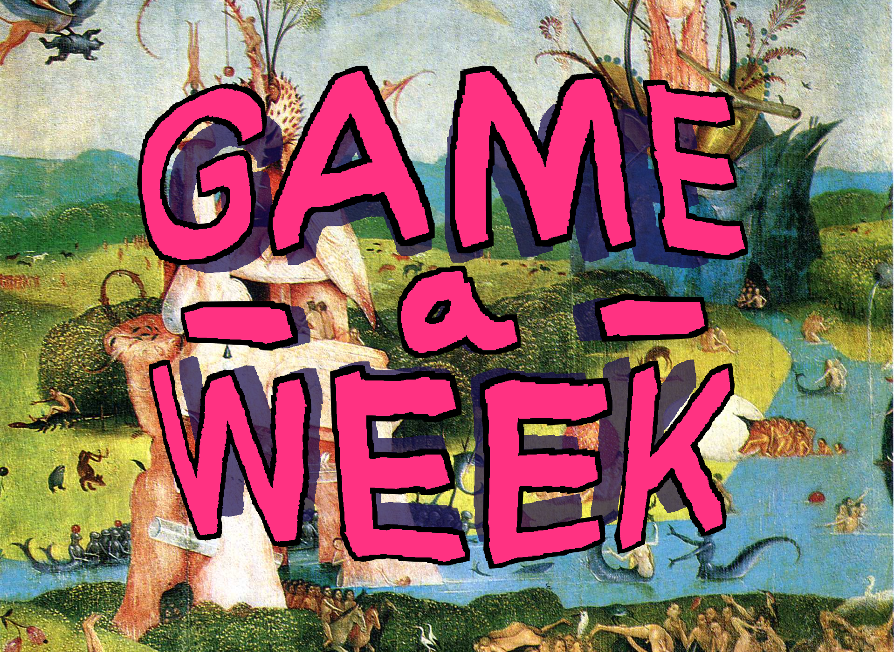
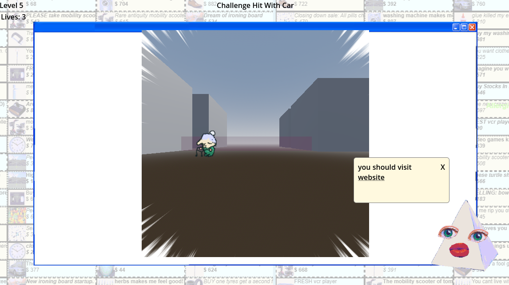
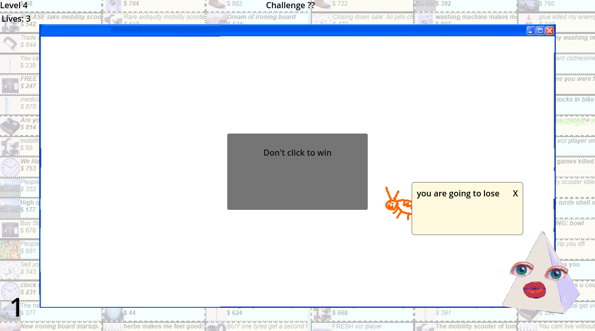
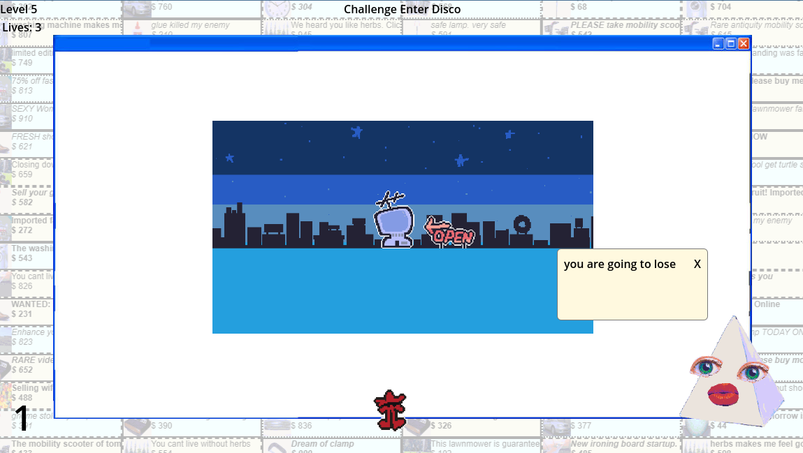
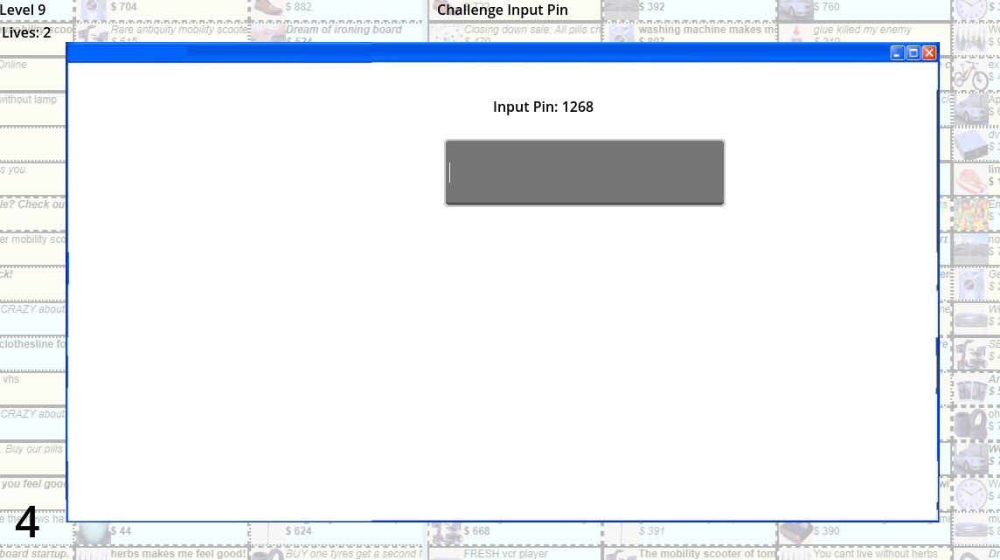

# Game-A-Week 2026: Week 2

| |  
|---|---|

> Game-A-Week is an intensive program in which participants will create 6 prototype games or works - one each week. The aims of Game-A-Week are multifaceted and center around the benefits of “sketching” - something not practiced as often in games as other arts. With your “sketches”, you’ll practice working on small scope ideas, experimenting in a low stakes and supportive environment, practice receiving feedback and help discover and develop your own taste as an artist. Drawing influence from game jams, Game-A-Week will prompt you with weekly thematic, aesthetic, or mechanical constraints (e.g. “time” or “black-and-white” or “one-button input”).

## Theme: Speed

> This week we’re focusing on creating a sense of speed! How do we do that with our senses? How do we accomplish that with the pacing and structure of a work? How do we thrill people, make them react fast, and make them feel like they’re put under the pump?

## Game: MicroWare Janked!

*This write-up was written after GAW26 concluded, with more retrospective notes*

I love microgames. I have been playing so much [buster jam](https://store.steampowered.com/app/3858070/Buster_Jam_Demo/) and [MINDWAVE](https://store.steampowered.com/app/2701030/MINDWAVE/), and grew up playing Warioware Touched on my Nintendo DS. My friend also got me to play WarioWare: Move It! on Switch which was very, very fun. These games are often so ridiculous and absurdist, and really scratch a particular itch. Big fan. Naturally, I've wanted to try to make a bunch of microgames for years. Though I've never tackled this, knowing that there would be a lot of work involved. 

Speed felt like the perfect theme to try this out on. I had actually planned to do similar in the previous week, (Thinking Small = micro), based around completing captchas, but it was too big!! Funnier, my friend sent me a [game](https://paperhatprojects.itch.io/captchaware) shortly after which was exactly what I wanted to make/play, which I had a good laugh about. Writing this after week 6, it seems that just about every week was very busy, and I wasn't able to complete any games to the degree I wanted, this being no exception. 

I was able to build out a very rudimental system for challenges, which allows their logic to be self-contained, whilst being part of a parent class which enabled handling of success/fail states. There are 5 challenges in the game, which are chosen in a random order, and cannot repeat the same game until all have been cycled. 

During this week, I ended up being quite unhappy with this game. I recall being quite overwhelmed, and feeling like I was cobbling together different ideas and styles with no direct vision. In retrospect, I disagree, and think I did quite well all considered. There is a game loop, with lives and level tracking, making this technically a functional game, despite some jank in the games (shout out the one with white on white text).

There are a few references to other projects hidden in this one. The background image, and popup pyramidal sprite are taken from [Virtual Dream](https://virtualdream.live/), and the disco game is taken from my [Snowcret Santa game jam entry](https://umconfortable.itch.io/disco). The music was also intended for another game, but I can't remember which!! Glad i got to use it for something so fitting though.

## Acknowledgements
- wario, and all the sound effects i stole
- scar, rowan, daniel for playing warioware with me after a long d&d session
- people keeping the microgame genre alive wow thats so cool how do you design so many wacky games